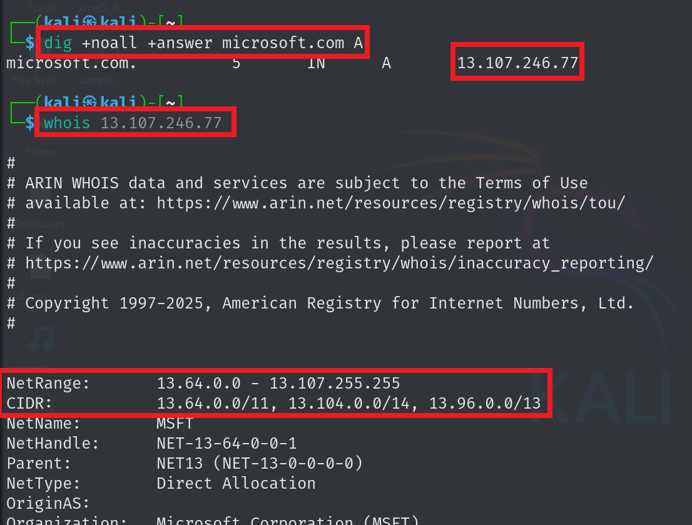

# Network Penetration Testing

## 1. General Enumerations

### Configuration `/etc/resolv.conf`

```conf
# Generated by NetworkManager
search localdomain
search pentestlab.local
nameserver 192.168.109.2
nameserver 8.8.8.8
nameserver 8.8.4.4
nameserver 1.1.1.1
nameserver 1.0.0.1
nameserver 9.9.9.9
nameserver 149.112.112.112
nameserver 208.67.222.222
nameserver 94.140.14.14
```

### DNS Enumeration
```bash
dig +noall +answer microsoft.com ANY
dig +noall +answer @dns-server-name microsoft.com ANY
dig +noall +answer +norecurse microsoft.com ANY
dnsrecon -d microsoft.com
dnsrecon -d microsoft.com -n dns-server-name
```
### Zone Transfer
```bash
dig +noall +answer microsoft.com NS
dig +noall +answer @company-dns-server microsoft.com AXFR
dnsrecon -d microsoft.com -t AXFR
```
### Sub Domains
- Google Dorks
    - `site:*.wikipedia.org -www -store -jobs -uk`
    - `site:*.*.example.com`
- Tools
    - `theHarvester -d microsoft.com -b bing`
    - ` subfinder -d microsoft.com `
    - `amass enum -passive -d microsoft.com`
    - `assetfinder --subs-only microsoft.com`
- Sites
    - https://crt.sh/
    - https://developers.facebook.com/tools/ct/

### recon-ng
```bash
recon-ng
# commands
# install modules
marketplace install all
# workspace for management 
workspaces create target-name
workspaces list
workspaces load target-name

# search in modules
modules search module-name
# know what is variables is needed
options list
# set the variable
option set variable-name value
run
# Modules 
modules load recon/domains-hosts/hackertarget
options set SOURCE microsoft.com
run

modules load recon/domains-hosts/google_site_web
options set SOURCE microsoft.com
run

```
### Reverse Lookup
- Network Range
    - `dig +noall +answer microsoft.com A` to get ips
    - `whois ip` to get the range
    