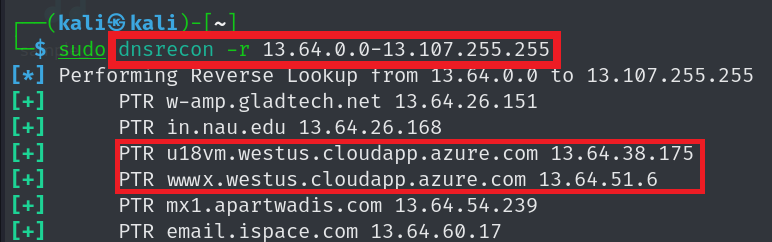
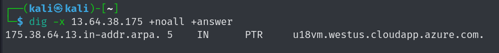
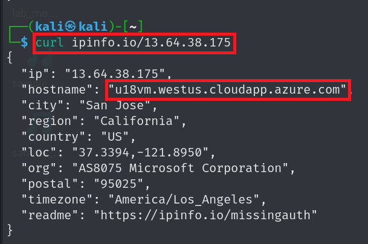

# Network Penetration Testing

## 1. General Enumerations

### Configuration `/etc/resolv.conf`

```conf
# Generated by NetworkManager
search localdomain
search pentestlab.local
nameserver 192.168.109.2
nameserver 8.8.8.8
nameserver 8.8.4.4
nameserver 1.1.1.1
nameserver 1.0.0.1
nameserver 9.9.9.9
nameserver 149.112.112.112
nameserver 208.67.222.222
nameserver 94.140.14.14
```

### DNS Enumeration
```bash
dig +noall +answer microsoft.com ANY
dig +noall +answer @dns-server-name microsoft.com ANY
dig +noall +answer +norecurse microsoft.com ANY

nslookup -type=ANY microsoft.com
nslookup -type=ANY @dns-server-name microsoft.com

host -a microsoft.com
host -t ANY microsoft.com

dnsrecon -d microsoft.com
dnsrecon -d microsoft.com -n dns-server-name
```
### Zone Transfer
```bash
dig +noall +answer microsoft.com NS
dig +noall +answer @company-dns-server microsoft.com AXFR
dnsrecon -d microsoft.com -t AXFR

for ns in $(dig +short microsoft.com NS); do 
  echo "Checking $ns"; 
  dig axfr @"$ns" microsoft.com; 
done

```
### Sub Domains
- Google Dorks
    - `site:*.wikipedia.org -www -store -jobs -uk`
    - `site:*.*.example.com`
    - https://www.dorkgpt.com/
- Tools
    - `theHarvester -d microsoft.com -b hackertarget,rapiddns,otx,urlscan,yahoo -l 500`
    - ` subfinder -d microsoft.com -all`
    - `amass enum -passive -d microsoft.com`
    - `amass enum -active -brute -d microsoft.com`
    - `assetfinder --subs-only microsoft.com`
- Sites
    - https://crt.sh/
    - https://developers.facebook.com/tools/ct/

#### recon-ng
```bash
recon-ng
# commands
# install modules
marketplace install all
# workspace for management 
workspaces create target-name
workspaces list
workspaces load target-name

# search in modules
modules search module-name
# use module
modules load module-name
# know what variables are needed
options list
# set the variable
option set variable-name value
run
# Modules 
modules load recon/domains-hosts/hackertarget
options set SOURCE microsoft.com
run

modules load recon/domains-hosts/google_site_web
options set SOURCE microsoft.com
run

```
#### Reverse Lookup
> Reverse Lookup means resolving IP addresses to domain names.

- **Network Range**
    - `dig +noall +answer microsoft.com A`
    - `whois <ip>` 
    

- **Convert IPs to Domains (Reverse Lookup)**
    - `dnsrecon -r 13.64.0.0-13.107.255.255`
    - `dnsrecon -r 13.64.0.0/16`
    
    - `dig -x 13.64.38.175 +noall +answer`
    
    - `curl ipinfo.io/13.64.38.175` 


#### Brute Force
- `dnsrecon -t brt -d microsoft.com -D /usr/share/dnsrecon/dnsrecon/data/namelist.txt`
- Recon-ng
    - `modules load recon/domains-hosts/brute_hosts`
    - Resolve and Extract
        - `modules load recon/hosts-hosts/resolve`
        - `modules load reporting/list` 

## 2. Scanning
### Tips
- use IP addresses instead of Domain name.
- use most popular port instead of all ports.
- Run a sniffer.
    > to know what is going on
### Sniffer
#### TCPdump
> Key Flags
- `-nn` : Don't resolve hostnames or port names.
- `-X` : Show the packet's contents in both HEX ad ASCII.
- `-v` :  Being more verbose(increase number of packet information)
- `-i` : Listen to a specific interface
- `-s`: Define the snaplength(size) of the capture in bytes. Use `-s0` to get
everything.
- `-w` : write to `.pcap`
- `-r` : read from `pcap`
```bash
tcpdump -nn -X -v -i eth0 -s0

#tcpdump -nn {tcp|udp|icmp|arp|ip} {and|or|not} port number {and|or|not} {dst|src|host} ip

tcpdump -nn tcp and port 21 and host 192.168.1.1 -s0 -i eth0 -w ftp.pcapng

tcpdump -nn -r ftp.pcapng
```


