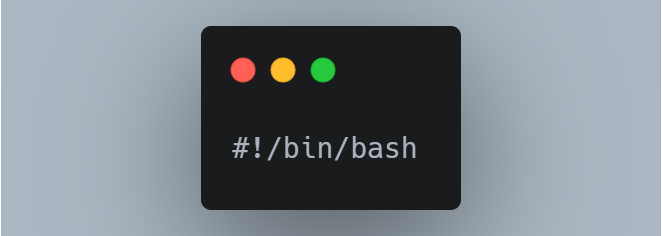
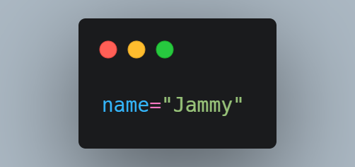

# first bash script
## top of script

this to your shell knows this file needs to run using bash.
## Run normal commends
you can also perform normal linux commands inside ur bash script

## Run the bash file
now to run our bash script must give it executable permissions => Chmod +x yourfile.sh
run it using => ./

# variables

name="value" !!! no space to work
to use our variable name we have to add $ onto front of the variable 